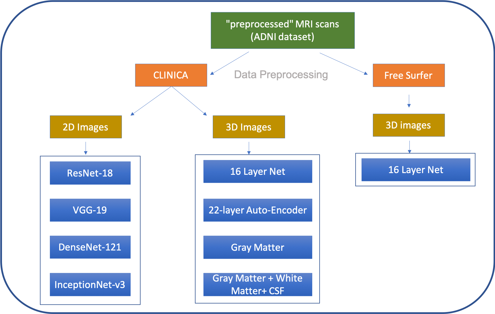

# A Comprehensive Study of Alzheimer's Disease Classification Using Convolutional Neural Networks

Ziqiang Guan, Ritesh Kumar, Yi Ren Fung, Madalina Fiterau

    <italics>University of Massachusetts, Amherst</italics>

[Paper](https://arxiv.org/abs/1904.07950) | [Website](https://information-fusion-lab-umass.github.io/alzheimers-cnn-study/)

## Abstract

A plethora of deep learning models have been developed for the task of Alzheimer's disease classification from brain MRI scans. Many of these models report high performance, achieving three-class classification accuracy of up to 95%. However, it is common for these studies to draw performance comparisons between models that are trained on different subsets of a dataset or use varying imaging preprocessing techniques, making it difficult to objectively assess model performance. Furthermore, many of these works do not provide details such as hyperparameters, the specific MRI scans used, or their source code, making it difficult to replicate their experiments. To address these concerns, we present a comprehensive study of some of the deep learning methods and architectures on the full set of images available from ADNI. We find that, (1) classification using 3D models gives an improvement of 1% in our setup, at the cost of significantly longer training time and more computation power, (2) with our dataset, pre-training yields minimal (<0.5%) improvement in model performance, (3) most popular convolutional neural network models yield similar performance when compared to each other. Lastly, we briefly compare the effects of two image preprocessing programs: FreeSurfer and Clinica, and find that the spatially normalized and segmented outputs from Clinica increased the accuracy of model prediction from 63% to 89% when compared to FreeSurfer images.

